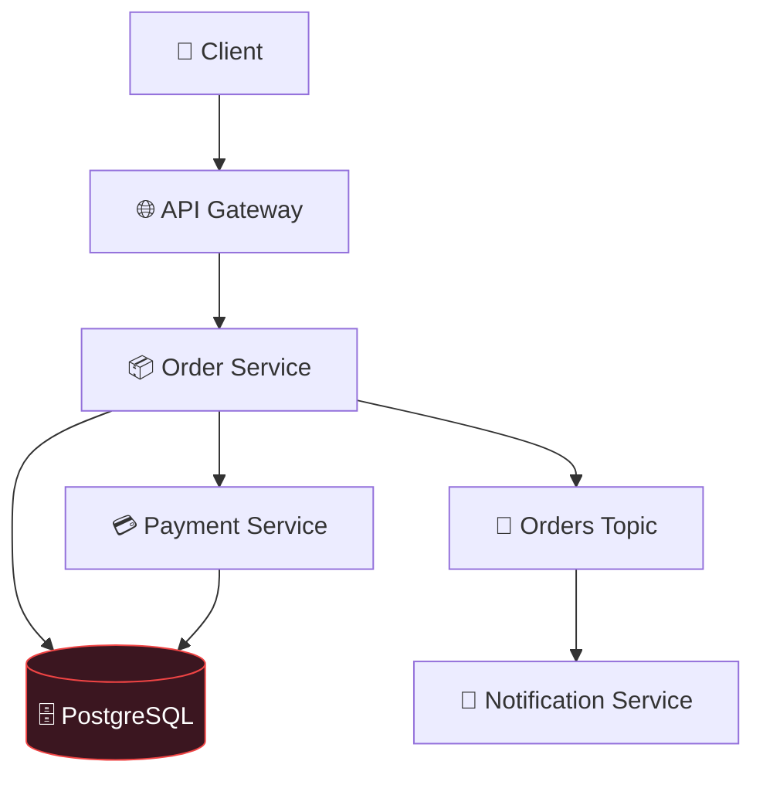
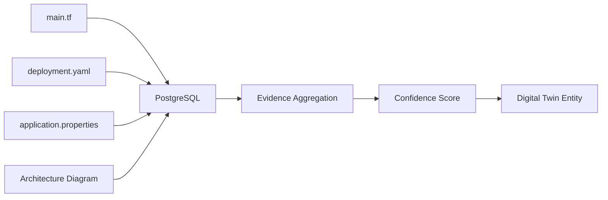
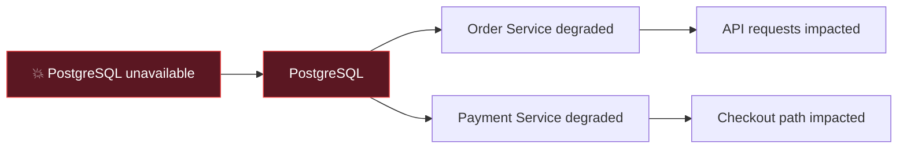
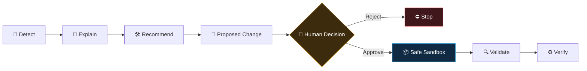
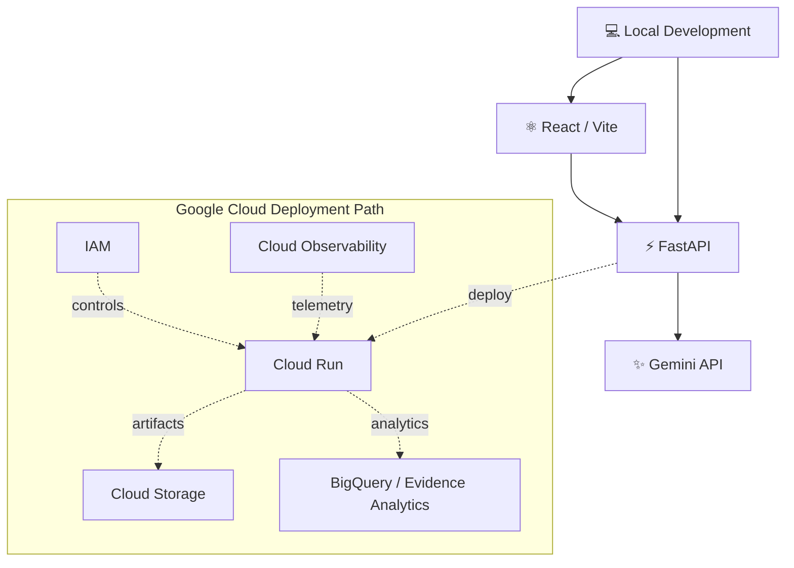
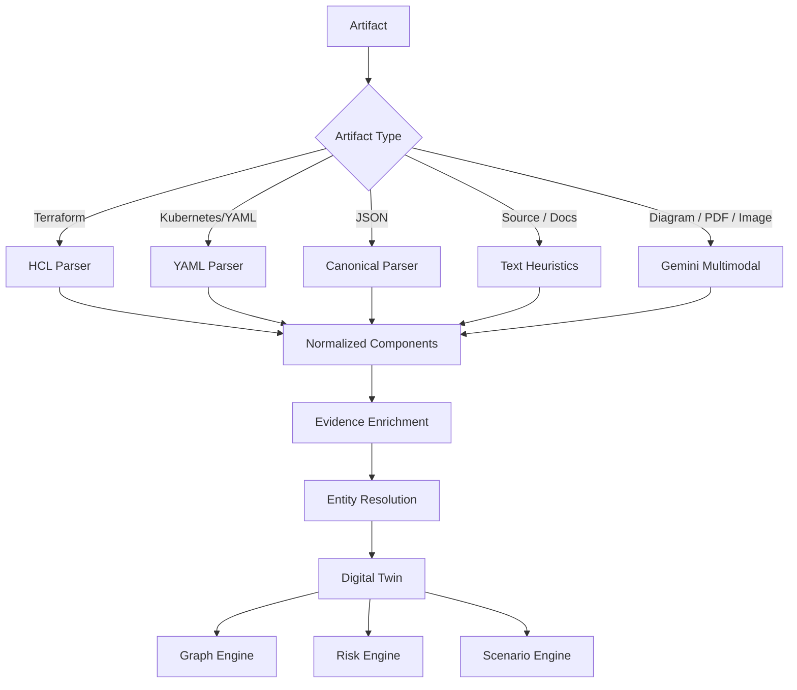
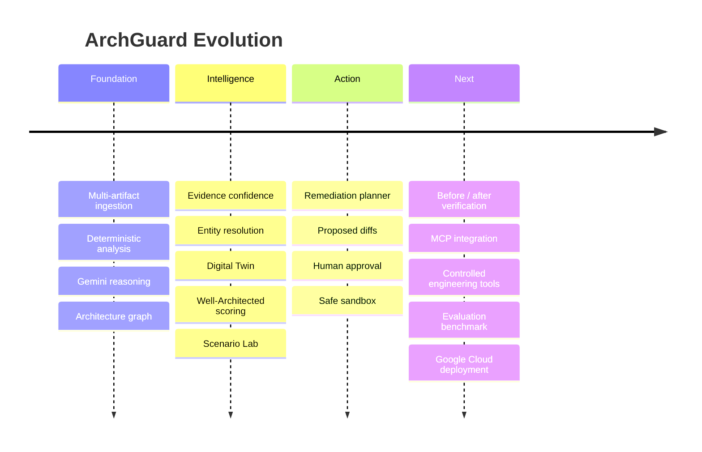

<div align="center">

# 🛡️ ArchGuard AI

**AI-Powered Architecture Analysis & Risk Prevention**

<p>
  <strong>Turn fragmented engineering artifacts into an explainable architecture digital twin — then reason about what can break before production does.</strong>
</p>

<p>
  
  
  
  
  
  
</p>


</div>

---

## ✦ The Big Idea

> **What if architecture reviews happened before production incidents — not after them?**

Modern systems rarely have a single source of architectural truth. The real architecture is scattered across Terraform, Kubernetes manifests, source code, API contracts, configuration files, diagrams and documentation.

Traditional architecture reviews therefore depend on manually reconstructing the system before the actual review can even begin.

**ArchGuard AI changes that workflow.**

It ingests heterogeneous engineering evidence, reconstructs a canonical view of the system, builds an **evidence-backed Architecture Digital Twin**, combines **Gemini reasoning + deterministic analysis + graph intelligence**, stress-tests the topology with failure scenarios, ranks risks, and produces remediation proposals behind a **human approval boundary**.

---

# 🚀 What ArchGuard Does

<table>
<tr>
<td width="50%">

### 📥 Understands the system

ArchGuard accepts engineering artifacts such as:

- Terraform / HCL
- Kubernetes YAML
- JSON / YAML architecture definitions
- Source code
- API specifications
- Configuration files
- Markdown / technical documentation
- Architecture diagrams and supported media

Instead of treating each artifact independently, the ingestion pipeline attempts to reconstruct a **single canonical architecture model**.

</td>
<td width="50%">

### 🧠 Reasons about the system

Once reconstructed, ArchGuard evaluates:

- Single points of failure
- Shared infrastructure risks
- High fan-in / fan-out dependencies
- Cascading failure paths
- Synchronous dependency risks
- Scalability bottlenecks
- Reliability weaknesses
- Security concerns
- Critical components
- Failure blast radius
- Architecture improvement opportunities

</td>
</tr>
</table>


---

# 🧬 Architecture Digital Twin

A central idea in ArchGuard is that architecture analysis should not operate on disconnected text fragments.

The ingestion pipeline resolves discovered services and dependencies into a graph-like **digital twin** containing:

- canonical component identities,
- aliases discovered across artifacts,
- component types,
- dependency edges,
- incoming/outgoing dependency metadata,
- supporting evidence,
- confidence scores,
- entity-resolution history.

The UI exposes the reconstructed topology interactively, including component/dependency/evidence counts. The current frontend already renders the Digital Twin and its interactive dependency graph. fileciteturn4file2L449-L547

### Example



From this topology ArchGuard can reason that the database has multiple dependents, identify it as a potentially critical shared dependency, and explore what happens if that component becomes unavailable.

---

# 🔍 Evidence Before Assertions

LLM-only architecture review can sound confident even when the underlying evidence is weak.

ArchGuard therefore treats **evidence and confidence as first-class concepts**.



Different evidence sources can contribute different confidence levels. Multiple independent pieces of evidence strengthen confidence rather than simply duplicating a component.

This enables ArchGuard to answer not only:

> **“What do I think exists?”**

but also:

> **“Why do I think it exists, and how confident am I?”**

---

# 🧠 Hybrid Intelligence — Not Just an LLM Wrapper

ArchGuard deliberately combines multiple reasoning techniques.

| Intelligence layer | Purpose |
|---|---|
| **Gemini** | Semantic understanding, multimodal extraction and architecture reasoning |
| **Graph intelligence** | Dependency topology, centrality, blast radius and structural relationships |
| **Deterministic rules** | Repeatable detection of known architecture anti-patterns |
| **Evidence scoring** | Tracks why entities/connections were inferred |
| **Entity resolution** | Reconciles names such as `order-service`, `Order Service`, `order_service` |
| **Scenario simulation** | Explores hypothetical failures and traffic stress |
| **Grounded knowledge** | Adds relevant architectural context to analysis |
| **Risk scoring** | Prioritizes findings instead of returning an unordered warning dump |

The frontend exposes ranked findings and critical-component scores rather than only raw AI text. fileciteturn4file5L1197-L1268 fileciteturn4file5L1275-L1347

---

# ⚠️ Risk Intelligence

ArchGuard turns architectural observations into prioritized findings.

A finding can include:

```json
{
  "severity": "HIGH",
  "risk_score": 88,
  "component": "PostgreSQL",
  "category": "Reliability",
  "issue": "Shared database creates a single point of failure",
  "explanation": "Multiple critical services depend on one database instance.",
  "recommendation": "Introduce redundancy and validated failover.",
  "source": "graph_engine"
}
```

### Example risk landscape

```text
┌───────────────────────────────────────────────────────────────┐
│ HIGH     88/100   PostgreSQL                                  │
│ Shared database / single point of failure                     │
├───────────────────────────────────────────────────────────────┤
│ MEDIUM   68/100   Payment Service                             │
│ Synchronous dependency may amplify cascading failure          │
├───────────────────────────────────────────────────────────────┤
│ MEDIUM   62/100   Order Service                               │
│ Traffic burst may saturate a central request path             │
└───────────────────────────────────────────────────────────────┘
```

The application renders severity, risk score, affected component, explanation, recommendation and source in the findings experience. fileciteturn4file3L738-L765

---

# 🌪️ Scenario Lab

Finding a weakness is useful.

Understanding **what happens next** is more useful.

ArchGuard's scenario layer is designed to explore questions such as:

- What if traffic increases **100×**?
- What happens if the database becomes unavailable?
- Which services are downstream of a failed component?
- What is the estimated blast radius?
- Which dependency is likely to become the first bottleneck?
- What happens when a synchronous service dependency fails?



Scenario results are **topology-based predictions**, not claims of real production telemetry. That distinction is intentional.

---

# 📊 Well-Architected View

ArchGuard can organize architecture findings across the six Google Cloud Well-Architected Framework pillars:

| Pillar | ArchGuard asks |
|---|---|
| ⚙️ Operational Excellence | Can the system be operated, diagnosed and changed safely? |
| 🔐 Security | Are trust boundaries and access controls appropriately designed? |
| 🛡️ Reliability | Can critical paths tolerate dependency or infrastructure failures? |
| 💰 Cost Optimization | Are architectural choices likely to create unnecessary resource pressure? |
| ⚡ Performance Optimization | Where could load, fan-in or synchronous dependencies become bottlenecks? |
| 🌱 Sustainability | Can resource usage and architecture choices be made more efficient? |

The scoring layer is a **heuristic architecture-assessment aid**, not an official Google certification or audit.

---

# 🛠️ From Finding → Action

Most architecture analyzers stop here:

```text
⚠ Database is a single point of failure.
```

ArchGuard is designed to continue:

```text
⚠ Detect
   ↓
🧠 Explain
   ↓
🛠 Recommend
   ↓
📝 Produce proposed change
   ↓
👤 Human reviews
   ↓
📦 Safe sandbox
   ↓
✅ Validate
   ↓
♻ Re-analyze
```

The current remediation UI generates safe architecture-fix proposals from ranked findings and explicitly communicates that no infrastructure or source-code changes have been executed automatically. fileciteturn4file3L750-L765 fileciteturn4file3L890-L925

---

# 🔐 Human-in-the-Loop by Design

ArchGuard follows a deliberate safety boundary:



### Safety invariants

```text
Human approval required
        ≠
Production execution permission
```

ArchGuard's remediation proposal state explicitly distinguishes:

- `proposed`
- `approved`
- `rejected`
- `execution_allowed`

The UI already supports proposal generation, proposed-diff preview and approval/rejection interactions. fileciteturn4file4L977-L1036

The controlled execution layer is being developed around **sandbox-first execution**. Real infrastructure mutation is intentionally not presented as an already-complete capability.

---

# ✨ Functional Capabilities

### Implemented / prototype capabilities

- [x] Multi-file architecture ingestion
- [x] Manual architecture input
- [x] Canonical architecture reconstruction
- [x] Artifact-aware parsing pipeline
- [x] Gemini-assisted architecture reasoning
- [x] Multimodal architecture extraction path
- [x] Deterministic architecture rules
- [x] Graph-based dependency intelligence
- [x] Risk scoring and ranking
- [x] Critical-component analysis
- [x] Evidence and confidence model
- [x] Entity resolution
- [x] Architecture Digital Twin
- [x] Interactive dependency topology
- [x] Scenario-analysis engine
- [x] Well-Architected scoring layer
- [x] Remediation proposal generation
- [x] Human approval/rejection workflow
- [x] Proposed change preview
- [x] Complete sandbox execution UX
- [x] Before/after verification loop
- [x] MCP connector layer
- [x] Controlled external-tool execution
- [x] Cloud-hosted deployment
- [x] Evaluation and benchmark suite

---

# 🧰 Technical Stack

<table>
<tr>
<td valign="top" width="33%">

### Backend

- **Python**
- **FastAPI**
- **Pydantic**
- **Uvicorn**
- **PyYAML**
- **python-hcl2**
- **NetworkX**

</td>
<td valign="top" width="33%">

### AI & Intelligence

- **Google Gemini**
- Structured model output
- Multimodal extraction
- Deterministic rule engine
- Graph analytics
- Evidence scoring
- Scenario simulation
- Grounded retrieval

</td>
<td valign="top" width="33%">

### Frontend

- **React**
- **Vite**
- **@xyflow/react**
- Interactive architecture graph
- Risk dashboard
- Remediation workflow
- Human approval UI

</td>
</tr>
</table>

### Architecture

The project is designed to remain compatible with a Google Cloud-native deployment path while keeping local development inexpensive.



Dashed cloud connections represent the deployment direction rather than a claim that every service is already deployed.

---

# 🧩 Why a Digital Twin Matters

Consider three files:

```text
main.tf
    └── resource refers to PostgreSQL

application.properties
    └── jdbc:postgresql://...

deployment.yaml
    └── order-service

README.md
    └── "Order API stores orders in Postgres"
```

A basic analyzer might produce four unrelated observations.

ArchGuard tries to resolve them into:

```text
Order Service ───────────► PostgreSQL
     │                         ▲
     │                         │
     └──── evidence ───────────┘
```

That canonical representation becomes reusable across:

```text
Risk analysis
Scenario simulation
Criticality analysis
Remediation
Verification
Visualization
```

This is the foundation that turns ArchGuard from a document summarizer into an architecture-analysis system.

---

# 🔬 Analysis Pipeline



---

# 🧪 Example Demo

A compact demo can deliberately contain realistic weaknesses:

```text
Client
  ↓
API Gateway
  ↓
Order Service ──────────────┐
  │                         │
  ↓                         ↓
Payment Service ────────► PostgreSQL
  │
  └──── synchronous dependency
```

### ArchGuard should reveal

**1. Architecture reconstruction**

```text
4 components
4 dependencies
```

**2. Graph intelligence**

```text
PostgreSQL → high fan-in
Order Service → central dependency path
```

**3. Risk intelligence**

```text
HIGH    Shared DB / SPOF
MEDIUM  Synchronous payment dependency
MEDIUM  Cascading failure potential
```

**4. Scenario**

```text
Scenario: PostgreSQL unavailable

Predicted impact:
PostgreSQL
  ├── Order Service
  └── Payment Service
```

**5. Remediation**

```text
Recommendation:
Introduce database HA/failover and isolate synchronous failure paths.
```

**6. Human control**

```text
[ Preview Proposed Diff ]
[ Approve Proposal ]
[ Reject ]
```

This demonstrates an end-to-end engineering workflow rather than a single chatbot prompt.

---

# 🖥️ Product Experience

The current interface includes:

### 01 — Architecture Input

Upload one or more architecture artifacts or use manual input. The UI tracks uploaded files and input readiness. fileciteturn4file6L1479-L1504

### 02 — Interactive Digital Twin

Explore reconstructed entities, dependencies, evidence and confidence through an interactive graph. fileciteturn4file7L1795-L1927

### 03 — Architecture Intelligence

View component count, connection count, findings and Gemini availability alongside graph-based critical-component rankings. fileciteturn4file2L551-L639

### 04 — Ranked Risk Findings

Findings are surfaced with severity and risk scores instead of an unstructured wall of model output.

### 05 — Remediation

Generate architecture-fix proposals while keeping infrastructure changes behind an explicit approval boundary. fileciteturn4file3L750-L765

### 06 — Proposed Change Review

Preview a proposed change and approve or reject it before any controlled execution stage. fileciteturn4file4L986-L1107

---

# 📡 API Surface

Core API responsibilities:

| Endpoint | Responsibility |
|---|---|
| `POST /ingest` | Parse artifacts and reconstruct architecture |
| `POST /analyze` | Run architecture intelligence pipeline |
| `POST /scenario` | Run topology-based what-if scenarios |
| `POST /orchestrate` | Build/coordinate analysis workflow |
| `POST /remediation-plan` | Generate remediation proposals |
| `GET /remediation/{id}/diff` | Preview a proposed change |
| `POST /remediation/approve` | Record human approval |
| `POST /remediation/reject` | Record rejection |
| `POST /remediation/{id}/execute-sandbox` | Controlled local sandbox execution path |

> Endpoint availability depends on the current branch/prototype stage. The repository intentionally separates **proposal**, **approval**, and **execution**.

---

# 🔒 Security Philosophy

ArchGuard analyzes infrastructure and software architecture, so automation must be conservative by default.

### Core rule

> **Detection is not authorization. Recommendation is not authorization. Approval of a proposal is not unrestricted production access.**

A future external tool/MCP integration should preserve:

```text
Detect
  ↓
Explain
  ↓
Recommend
  ↓
Human Approval
  ↓
Execute only authorized operation
  ↓
Validate
  ↓
Verify
```

Additional principles:

- Secrets must never be committed to the repository.
- `.env` belongs in `.gitignore`.
- API keys should be supplied through environment variables.
- External execution should use least privilege.
- Destructive actions require explicit authorization.
- Generated changes should be inspectable before execution.
- Validation should precede verification.
- Production modification should never be inferred from analysis intent.

---

# 📁 Suggested Repository Structure

```text
ArchGuard-AI/
│
├── backend/
│   └── app/
│       ├── api.py
│       ├── ingestion.py
│       ├── artifact_parser.py
│       ├── terraform_parser.py
│       ├── multimodal_parser.py
│       ├── evidence_engine.py
│       ├── digital_twin.py
│       ├── graph_engine.py
│       ├── risk_engine.py
│       ├── scenario_lab.py
│       ├── well_architected.py
│       ├── remediation_engine.py
│       ├── approval_engine.py
│       ├── diff_engine.py
│       ├── sandbox_executor.py
│       ├── sandbox_validator.py
│       └── tool_layer.py
│
├── frontend/
│   ├── src/
│   │   ├── App.jsx
│   │   ├── App.css
│   │   └── components/
│   │       ├── FileDropZone.jsx
│   │       └── ArchitectureGraph.jsx
│   │
│   └── package.json
│
├── requirements.txt
├── .env.example
├── .gitignore
└── README.md
```

---

# ⚡ Run Locally

## 1. Clone

```bash
git clone <YOUR_REPOSITORY_URL>
cd ArchGuard-AI
```

## 2. Create Python environment

```bash
python3 -m venv .venv
source .venv/bin/activate
```

Windows:

```bash
.venv\Scripts\activate
```

## 3. Install backend dependencies

```bash
pip install -r requirements.txt
```

Typical dependencies include:

```text
fastapi
uvicorn[standard]
python-multipart
PyYAML
networkx
google-genai
pydantic
python-dotenv
python-hcl2
```

## 4. Configure environment

Create:

```text
.env
```

Example:

```env
GEMINI_API_KEY=your_api_key_here
```

> Never commit `.env`.

A repository-safe `.env.example` should contain variable names only:

```env
GEMINI_API_KEY=
```

## 5. Start backend

```bash
python3 -m uvicorn backend.app.api:app --reload
```

Backend:

```text
http://127.0.0.1:8000
```

Swagger:

```text
http://127.0.0.1:8000/docs
```

## 6. Start frontend

In another terminal:

```bash
cd frontend
npm install
npm run dev
```

Frontend:

```text
http://localhost:5173
```

---

# 🧾 Example Architecture Input

```json
{
  "services": [
    {
      "name": "API Gateway",
      "type": "gateway"
    },
    {
      "name": "Order Service",
      "type": "microservice"
    },
    {
      "name": "Payment Service",
      "type": "microservice"
    },
    {
      "name": "PostgreSQL",
      "type": "database"
    }
  ],
  "connections": [
    ["API Gateway", "Order Service"],
    ["Order Service", "Payment Service"],
    ["Order Service", "PostgreSQL"],
    ["Payment Service", "PostgreSQL"]
  ]
}
```

This same four-component sample architecture is present in the current frontend prototype. fileciteturn3file0L15-L39

---

# 🎯 What Makes ArchGuard Different?

### 1. It reconstructs before it judges

The system first asks:

> *What architecture is actually represented by these artifacts?*

Only then does it analyze risks.

### 2. It combines AI with deterministic engineering

Gemini is one reasoning layer — not the entire product.

Graph algorithms, parsers, entity resolution, deterministic rules and evidence scoring provide structure around AI reasoning.

### 3. Findings remain connected to architecture

Risks are associated with components, dependencies and evidence rather than appearing as isolated prose.

### 4. It predicts failure paths

Scenario analysis explores potential blast radius and bottlenecks instead of stopping at static linting.

### 5. It aims to close the remediation loop safely

```text
Finding → Proposal → Diff → Approval → Sandbox → Validation → Verification
```

### 6. Human control is part of the architecture

Human approval is not a UI decoration. It is an explicit state transition between recommendation and controlled execution.

---

# 🏆 Competition Narrative

ArchGuard AI addresses a practical engineering problem:

**Teams possess huge amounts of architectural evidence but lack a continuously reconstructed, explainable view of how those pieces form a system and how that system may behave under stress.**

The project demonstrates how generative AI can be combined with classical engineering techniques instead of replacing them.

### Technical depth

- heterogeneous artifact parsing,
- multimodal AI extraction,
- canonical architecture modeling,
- entity resolution,
- evidence aggregation,
- graph algorithms,
- deterministic risk detection,
- structured AI output,
- scenario simulation,
- confidence-aware analysis,
- remediation planning,
- human-in-the-loop controls,
- sandbox-oriented execution.

### Functional value

For an engineer, the experience is intentionally simple:

```text
Upload system artifacts
        ↓
See reconstructed architecture
        ↓
Understand critical dependencies
        ↓
See prioritized risks
        ↓
Stress-test the design
        ↓
Review suggested fixes
        ↓
Approve only what you trust
        ↓
Validate and verify
```

---

# 🗺️ Roadmap



---

# 🔮 Future Direction

The long-term vision is an architecture engineering agent that can connect to authorized development and infrastructure tools through a controlled MCP/tool layer.

Examples:

```text
Git repository
Terraform
Kubernetes
Issue tracker
Observability
Cloud architecture metadata
CI/CD
```

But external execution must preserve the safety contract:

```text
Agent can investigate freely
Agent can recommend clearly
Agent can propose precisely
Agent cannot make consequential changes silently
```

---

# 📈 Success Metrics

ArchGuard can eventually be evaluated on more than “did the model produce a nice answer?”

Potential benchmark dimensions include:

| Dimension | Example metric |
|---|---|
| Reconstruction | Component / dependency precision & recall |
| Entity resolution | Correct alias merges |
| Risk detection | Precision / recall against seeded architecture flaws |
| Evidence | Correct source attribution |
| Scenario analysis | Correct affected-component set |
| Remediation | Reviewer acceptance rate |
| Safety | Unauthorized execution attempts blocked |
| Verification | Reduction in detected risk after accepted remediation |
| Latency | End-to-end analysis time |

This makes the project measurable and suitable for rigorous competition evaluation.

---

# ⚠️ Prototype Status

ArchGuard AI is an engineering prototype.

Its risk scores, scenario predictions and Well-Architected scores are **decision-support signals**, not guarantees about real production behavior.

Real-world architecture decisions should additionally use:

- runtime telemetry,
- load testing,
- security review,
- cloud-provider validation,
- operational context,
- human engineering judgment.

---

<div align="center">

## 🛡️ ArchGuard AI

### **Understand the architecture. Predict the failure. Fix it before production does.**

`Evidence → Digital Twin → Intelligence → Simulation → Remediation → Human Approval → Verification`

<br/>

**Built for engineers who want AI to explain systems — not just generate text about them.**

<br/>

⭐ **If ArchGuard helps you think differently about architecture reviews, star the repository.**

</div>
